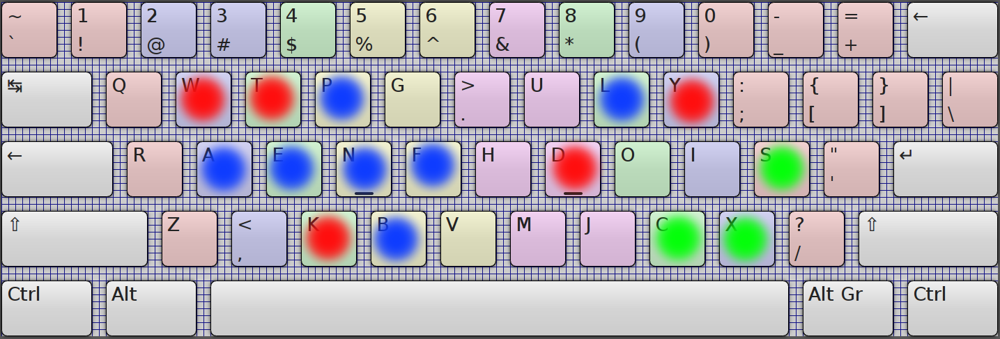

Research for ergonomic keyboard layout
======================================

Text below will be translated. Now I just quickly record thoughts about the project in the language I know better than English.

Предпосылки
---------------

Большинство компьютерных клавиатур в принципе непригодны для десятипальцевого набора текста, но для
отдельных применений можно снизить неудобства использования сменой клавиатурной раскладки. Я говорю о
латинской раскладке qwerty и её близких вариациях. В разное время предлагалось немало альтернатив улучшающих
эргономические параметры qwerty, но по ряду причин они не получили распространения и не получат. Полагаю,
главной ошибкой была сама идея получить оптимальную для всех задач клавиатурную раскладку. Поскольку разные
задачи могут сильно разниться в наборах часто используемых для них слов. Взять хотя бы различные языки
программирования, с разнообразными ключевыми слови, также где-то активно применяются круглые скобки, где-то
фигурные и т.п. Отчасти это решается оптимизацией набора макросами (автодополнения и сокращения).

Простые выводы:

1. Людям работающим с разными наборами слов в языке требуются во многом противоречащие раскладки.

2. Поиск оптимальной клавиатуры для всех категорий пользователей (не говоря о пользователях
пишущих на разных языках) — идея столь же утопичная, как поиск универсального языка программирования.

3. Достижение максимального удобства невозможно без изменения физических параметров клавиатуры.
На подавляющем большинстве клавиатур, копирующих устаревшие паттерны проектирования пишущих машинок, в
принципе невозможно добиться значительного удобства набора.

Поэтому в своем исследовании я поставил скромную цель подбора оптимальной раскладки для узкого круга задач,
для начала взяв за цель получить раскладку для типовых задач, которые сам решаю за компьютером.
В своей работе за компьютером я провожу большую часть времени в двух программах — в GNU Emacs и в шелле. Шелл
(я предпочитаю fish) разумеется включён с привязками клавиш в стиле Emacs. Также я использую броузеры Chrome и
Firefox, и реже другие графические программы. Поэтому для оптимизации работы, мне важно добиться удобства
работы с управляющими комбинациями Emacs, о многочисленности и замысловатости которых в компьютерном мире
ходят анекдоты. А также привести удобство размещения клавиш для наиболее часто употребимых комбинаций символов
к параметрам альтернативных раскладок. В выборе альтернатив я рассматривал различные варианты, начиная с
наиболее известного Дворака, до редких вариантов, подбираемых компьютерными симуляторами по различным критериям
удобства. В итоге, по сильно субъективным критерям за основу был выбран вариант Colemak.

Очевидно, что раскладка оптимизированная под управляющие символы конкретного набора программ (в моём случае это
emacs world) будет уступать раскладке общецелевого назначения. Но с другой стороны, известные альтернативные
раскладки вроде Дворака или Колемака приносят такие проблемы в ребиндингах клавиш во используемых программах,
что проще становится смириться с qwerty. Что собственно и происходило в моём случае на протяжении долгих лет, пока
я не дозрел до понимания, то универсальность — невозможна и надо её попросто игнорировать, сконцентрировавшись
на узком круге проблем.

Почему не сделать ремап клавиш в Emacs? Есть например удобные варианты как http://ergoemacs.org/emacs/ergonomic_emacs_keybinding.html
Действительно, емакс позволяет гибко настроить клавиатуру под себя. Но кроме непосредственно Emacs есть ведь ещё другие
программы, я уже упомянул шелл, есть emacs-совместимые редакторы. Не во всех удобно и вообще не всегда есть возможность
перенастройки раскладки, а вот выбор emacs-режима предлагают многие программы, во всяком случае все приличные IDE.
Поэтому, поправив раскладку системно, далее можно далее использовать emacs-совместимые программы без изменений.

Первые результаты: Colemacs
--------------------------------

Первый вариант раскладки, который я счёл удобным для использования и сейчас опробую на себе. За основу был взят
вариант Colemak, от него в результате мало что осталось, но я отразил этот источник вдохновения в названии
новой раскладки.

Клавиши перемещения по тексту с Ctl и Alt сгруппированы слева (выделеены синим на рисунке).
Основное применение их с Ctl, поэтому удобно применять
их левой рукой с нажатием правой рукой Ctl. Для перехода влево-вправо по строке это F и B, A и E – для перемещения в
начало/конец строки, для перехода вверх-вниз — P и N.

Клавиши редактирования (красным на рисунке) попадают под разные руки, как в исходной раскладке.

Также под левую руку сгруппированы клавиши управления вкладками броузера — Ctl+W,T,R, что удобно в комплекте с мышкой
под правую руку.

Итого, данная раскладка предназначена для работы с Emacs и использующими его клавиатурные биндинги программами, для
исключительно английского языка и оптимизируется под корпус слов применяемых в языках программирования (не во всех, ясно
дело, я беру за основу, то что использую сам — c, go, python, lisp).
Также раскладка не ориентирована на клавиатуры, где вопросы эргономики решены физической переработкой формы
клавиатуры и расположения клавиш (Maltron, Kinesis и др.) Я проверяю раскладку на своём ноутбуке Lenovo и клавиатуре
Microsoft Natural Ergonomic (самая адекватная клавиатура из дешевых, но к сожалению, эргономика её более декларирована в
названии, чем имеется на деле).

TODO оптимизировать верхний цифровой ряд и знаки препинания, а также обязательно скобки всех видов!

Результаты тестов на симуляторах
-------------------------------------

Это предварительные результаты, требуется дальнейшее тестирование.

Carpalx на дефолтном корпусе слов:

    Keyboard effort
    ------------------------------------------------------------
    k1                      0.861  74.7  74.7
    k1,k2                   1.109  21.5  96.2
    k1,k2,k3                1.152   3.8 100.0
    b                       0.398  19.7  19.7
    p                       0.754  37.3 152.9
    ph                      0.000   0.0   0.0
    pr                      0.204  27.0  27.0
    pf                      0.451  59.9  86.9
    s                       0.870  43.0 100.0
    all                     2.022 100.0 100.0

    keyboard row frequency
    ------------------------------------------------------------
    1                     2228900 24.4  24.4
    2                     5984904 65.4  89.8
    3                      937361 10.2 100.0

    keyboard hand frequency
    ------------------------------------------------------------
    0                     4922934 53.8  53.8
    1                     4228231 46.2 100.0

    keyboard finger frequency
    ------------------------------------------------------------
    0                      539877  5.9   5.9
    1                      974366 10.6  16.5
    2                     2085687 22.8  39.3
    3                     1323004 14.5  53.8
    6                     1509445 16.5  70.3
    7                     1309725 14.3  84.6
    8                      842785  9.2  93.8
    9                      566276  6.2 100.0

По общим усилиям набора в этом тесте Colemacs лучше раскладки Дворака, но хуже Colemak. Более равномерно
задействуются руки по сравнению с qwerty, с чуть большим использованием левой руки, т.к. на правую обычно
доп. нагрузка в виде мыши. Выровнено использование рядов, базовый ряд клавиатуры, на котором лежат руки
при десятипальцевом наборе занимет 65% набора (недостаток qwerty – перекос в более частое использование
верхнего ряда, в сравнении с базовым и нижним). Разгружены оба мизинца, получилось лучше даже в
сравнении с Colemak (не говоря уже о Dvorak с его завышенной нагрузкой на правый мизинец). Нагрузка на
указательный палец левой руки сделана чуть ниже, чем правой и на оба указательных значительно ниже, чем
во многих альтернативных раскладках. Я считаю, что указательные пальцы на клавиатурах и так сильно заняты
беготнёй по двум рядам и с двумя труднодоступными клавишами Y и B (указаны по раскладке qwerty). Указательный
левой руки разгружен по причине того, что на него в Colemacs возложены функции навигации по символам и строкам
(комбинации Ctl-F, Ctl-B, Ctl-A, Ctl-E, Ctl-P, Ctl-N). Нагрузка на правый указательный могла бы быть больше, но
пока перебирая варианты не удалось получить лучших результатов.

По результатам workman.php на тексте программы на языке go получилось (здесь меньшее значение — лучше):

* QWERTY: 63881
* Asset: 36557
* Capewell: 36410
* Colemak: 33875
* Colemacs: 38271
* Dvorak: 43352
* Klausler: 41301
* Minimak: 36466
* Norman: 35061
* QGMLWY: 43001
* Workman: 38474

Все результаты предварительные и требуют дополнительных тестов и уточнения критериев. На данный момент, могу только
заключить, что уже получилось удобнее чем дефолтная qwerty.

Со скоростью набора конечно пока первые дни всё печально, но в своё время я успешно различал три раскладки — русскую,
qwerty и латинскую фонетическую jcuken без задержек в переключении между ними. Поэтому изучение ещё одной раскладки уже
не пугает. Ориентировочно время освоения — 2 недели, с увеличением скорости до исходной за месяц.
